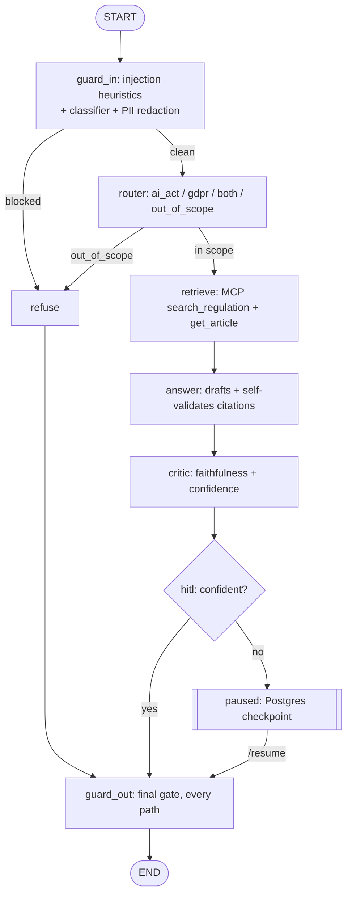

# Compliance Copilot

[](https://github.com/JayLakhani2002/compliance-copilot/actions/workflows/ci.yml)

Agentic RAG over the EU AI Act and GDPR: a LangGraph agent that answers
compliance questions grounded in the actual regulatory text, with every
citation checked against the excerpt it claims to quote. The differentiator
isn't the RAG pipeline itself — it's that every release is gated by measured
evals (retrieval, faithfulness, red-team attack success rate, trajectory),
guardrails are layered and red-team-tested rather than assumed, and a run
that pauses for human review survives a process restart rather than losing
state.

This is a portfolio project, built solo with an AI-assisted builder/reviewer
workflow (see the footer). It is not a production service handling real
user data.

## Headline numbers

All measured, none aspirational — see the source column for how to
reproduce each one.

| Metric | Value | Source |
|---|---|---|
| Retrieval hit@5 / MRR | 1.000 / 0.881 | `evals/golden_retrieval.jsonl`, `make quality-gate` — [ADR-0013](docs/decisions/ADR-0013-retrieval-strategy-articles-first.md) |
| Answer faithfulness (LLM-judge) | 1.000 (n=10) | `make quality-gate` then `uv run python -m evals.run_answer_eval` — [ADR-0017](docs/decisions/ADR-0017-quality-gate-cached-embeddings-custom-judge.md) |
| Judge calibration vs. human, `faithful` / `relevant` | κ 1.000 / κ 0.634 | n=20, **provisional labels** — [ADR-0027](docs/decisions/ADR-0027-judge-calibration.md), [docs/EVALS.md](docs/EVALS.md) |
| Red-team attack success rate | 0/40 | `make redteam` — [ADR-0022](docs/decisions/ADR-0022-redteam-asr-gate.md) |
| Red-team false positive rate | 0/20 | `make redteam` — [ADR-0022](docs/decisions/ADR-0022-redteam-asr-gate.md) |
| Benign citation errors (after fuzzy-quote fix) | 1/20 (was 6/20) | [ADR-0031](docs/decisions/ADR-0031-fuzzy-quote-matching.md) |
| Cost | €0.130 / 100 questions (63% cached input) | `make cost-report`, n=10 — [ADR-0029](docs/decisions/ADR-0029-cost-engineering.md) |
| Unit tests | 426 | `uv run pytest -m "not integration" -q` |
| ADRs | 33 | `docs/decisions/` |

Two numbers are marked provisional on purpose: the judge-calibration labels
above are the builder agent's own labels, not a human's — see
[Limitations](#limitations). Everything else is measured against the
committed fixtures/corpus in this repo, at the sample sizes stated (n=10 or
n=20 in most cases) — a snapshot against this project's own history, not a
claim that generalizes past it.

## Architecture



Containers (one Hetzner VPS): **Caddy** (TLS, the only exposed container) →
**api** (FastAPI + LangGraph; the MCP server runs inside it as a stdio
subprocess, not a separate container) → **Postgres+pgvector** (documents,
chunks, LangGraph checkpoints) + a **backup** sidecar. Tracing goes to
**Langfuse Cloud (EU region)**, not a self-hosted stack. Full diagrams
(C4 context/container, sequence diagram, trust boundaries, failure-mode
table) in [docs/ARCHITECTURE.md](docs/ARCHITECTURE.md).

## Five engineering stories

**Evals as merge gates, not a dashboard nobody reads.** Retrieval quality
(hit@5/MRR) runs on every PR against committed, real, cached embeddings —
no API key, no network call, no excuse to skip it. Faithfulness and the
red-team suite need a real key, so they run nightly / on-demand / on a
labelled PR instead of gating every push, an honest cost tradeoff, not a
missing gate. [ADR-0005](docs/decisions/ADR-0005-evaluation-pytest-ragas-llm-judge.md) ·
[ADR-0017](docs/decisions/ADR-0017-quality-gate-cached-embeddings-custom-judge.md) ·
[ADR-0022](docs/decisions/ADR-0022-redteam-asr-gate.md) ·
[ADR-0026](docs/decisions/ADR-0026-trajectory-evals.md)

**Layered guardrails, proven by an original red-team set, not assumed.**
Heuristics → cheap-LLM classifier → PII redaction → a final output gate that
runs on every path regardless of how a run got there — four independent
layers, each with its own fixture set. A 40-attack, 20-benign red-team suite
measures the *stack*, not each layer in isolation, and it found a real gap:
6/20 benign legal questions were failing citation validation on cosmetic
punctuation drift, not a security hole — fixed with a two-condition
fuzzy-match rule (a similarity floor *and* no added words) after a first
version was reviewed and found to still admit negation flips and appended
clauses. [ADR-0018](docs/decisions/ADR-0018-input-guard-heuristics.md)–[ADR-0022](docs/decisions/ADR-0022-redteam-asr-gate.md) ·
[ADR-0031](docs/decisions/ADR-0031-fuzzy-quote-matching.md)

**Durable state and a human-in-the-loop pause that survives a restart.**
Every run is checkpointed to Postgres, keyed by `thread_id` — a low-confidence
critic verdict pauses the graph with `interrupt()` instead of shipping an
uncertain answer, and that pause is a real database row, not in-memory
state: it outlives a container restart and resumes exactly where it left
off via `/resume`. [ADR-0024](docs/decisions/ADR-0024-durable-state-postgres-checkpointer.md) ·
[ADR-0025](docs/decisions/ADR-0025-human-in-the-loop-interrupt.md)

**Tools behind MCP, not hand-rolled into the graph.** Retrieval
(`search_regulation`, `get_article`, `cite`) is a standalone MCP server, so
the tool contract is decoupled from the agent framework — any MCP client
(Claude Desktop, another agent) can point at the same server.
[ADR-0007](docs/decisions/ADR-0007-tools-via-mcp.md)

**Cost measured, not estimated — and EU residency stated honestly, not
oversold.** €0.130/100 questions is a real number from a real run, not a
hand-computed token estimate. The residency story is stated as plainly as
the architecture doc does: storage and observability are EU by
construction (Hetzner, Langfuse Cloud EU); inference and embeddings run on
OpenAI's direct API today (not EU-region-pinned) — the documented
production path is AWS Bedrock `eu-central-1`, not shipped yet.
[ADR-0029](docs/decisions/ADR-0029-cost-engineering.md) · [docs/ARCHITECTURE.md §8](docs/ARCHITECTURE.md#8-data-residency-notes)

## Quickstart (dev)

```bash
make setup   # uv sync + install the pre-commit git hook (one-time)
cp .env.example .env   # fill in real secrets locally; DATABASE_URL default matches docker-compose.yml
make db-up   # start Postgres+pgvector via Docker Compose (needs Docker installed)
make db-init # create the vector extension, tables, and HNSW index
make test    # uv run pytest -m "not integration"
```

Run the API:

```bash
# set API_KEY in .env first (see .env.example)
make api  # uvicorn on http://127.0.0.1:8000, auto-reload
curl -sN -X POST localhost:8000/ask -H "Content-Type: application/json" \
  -H "X-API-Key: $API_KEY" -d '{"question":"When is an AI system high-risk?"}'
```

Set `LANGFUSE_PUBLIC_KEY`/`LANGFUSE_SECRET_KEY`/`LANGFUSE_BASE_URL` to enable
tracing (Langfuse Cloud, EU) — unset by default, so the app runs with zero
tracing until you do.

## Run in production

See [docs/DEPLOY.md](docs/DEPLOY.md) ([ADR-0033](docs/decisions/ADR-0033-deploy-runbook-and-iac-stub.md))
for the full Hetzner runbook — provisioning, hardening, DNS, `.env`, first
run, backup/restore drill, update/rollback, and an EU-residency checklist —
plus `deploy/deploy.sh` to automate the hardening/install steps, and
`infra/terraform/` for a validated-but-never-applied AWS `eu-central-1`
stub.

```bash
cp .env.example .env   # fill in real secrets + DEPLOY_HOSTNAME/ALLOWED_HOSTS/POSTGRES_*
docker compose -f docker-compose.prod.yml up -d
docker compose -f docker-compose.prod.yml exec api python -m compliance_copilot.cli init-db
docker compose -f docker-compose.prod.yml exec api python -m compliance_copilot.cli ingest --regulation all
```

`docker-compose.prod.yml` ([ADR-0032](docs/decisions/ADR-0032-production-compose.md))
is the deployed shape: Caddy (TLS, the only exposed container), `api`
(this repo's `Dockerfile`), `postgres`, and a `backup` sidecar dumping
daily with 7-day retention (`make backup-now` runs one on demand).

## API usage

Health/readiness ([ADR-0028](docs/decisions/ADR-0028-resilience-timeouts-fallbacks.md)):

```bash
curl localhost:8000/healthz  # liveness — process alive, no DB/LLM work
curl localhost:8000/readyz   # readiness — SELECT 1 against Postgres, 200 or 503
```

**Conversations (`thread_id`).** Omit it on the first call — the response's
first SSE event is `event: thread`, `data: {"thread_id": "<uuid>"}`. Send
that id back to continue (last 3 turns replayed into the prompt):

```bash
curl -sN -X POST localhost:8000/ask -H "Content-Type: application/json" \
  -H "X-API-Key: $API_KEY" \
  -d '{"question":"And what about GDPR?","thread_id":"<uuid from the first response>"}'
```

**Human review on low confidence (`interrupt`/`/resume`).** When the critic
scores below `CRITIC_CONFIDENCE_MIN` (default 0.6), the run pauses instead
of streaming a `final` event:

```
event: interrupt
data: {"thread_id": "<uuid>", "interrupt_id": "...", "status": "under_review"}
```

That's deliberately all an end user sees — no draft, confidence, or
reasoning on this channel. An operator reviews the full payload and
resolves it:

```bash
python -m compliance_copilot.cli resume <thread-id> --decision approve|edit|reject [--answer TEXT]
# or: POST /resume {"thread_id":..., "interrupt_id":..., "decision":"approve"|"edit"|"reject", "edited_answer":"..."}
```

`/resume` streams the same events `/ask` does; 404 on an unknown thread,
409 if it isn't currently paused or `interrupt_id` doesn't match the
pending review. Full detail (edit semantics, exit codes, the shared-key
caveat): [ADR-0024](docs/decisions/ADR-0024-durable-state-postgres-checkpointer.md),
[ADR-0025](docs/decisions/ADR-0025-human-in-the-loop-interrupt.md).

### MCP server

`make mcp` starts a standalone MCP server (`search_regulation`, `get_article`,
`cite`) over stdio — pointable from any MCP client, e.g. Claude Desktop:

```json
{
  "mcpServers": {
    "compliance-copilot": {
      "command": "uv",
      "args": ["run", "--project", "/path/to/repo", "python", "-m", "compliance_copilot.mcp_server"]
    }
  }
}
```

## Eval suite

| Command | What it runs | Needs a key? |
|---|---|---|
| `make quality-gate` | Retrieval hit@5/MRR, cached embeddings | No |
| `uv run python -m evals.run_answer_eval` | LLM-judge faithfulness on the golden set | Yes |
| `make redteam-fast` | Heuristics-only subset, 20+ attacks, plain pytest | No |
| `make redteam` | Full 40-attack + 20-benign pipeline, ASR/FPR gate | Yes |
| `make calibration` | Judge-vs-human agreement (κ) report | No (report step) |
| `make cost-report` | €/question, cached-token fraction | Yes |
| `make eval-cache` | Refresh committed embedding cache after a golden-set/corpus change | Yes |

Every gate, threshold, and where it runs: [docs/EVALS.md](docs/EVALS.md).

## Project structure

```
src/compliance_copilot/
  graph/          LangGraph nodes + build (guard_in, router, retrieve, answer, critic, hitl, guard_out)
  guards/         injection heuristics, PII redaction, output guard, quote matching
  ingest/         EUR-Lex fetch + chunk + embed pipeline
  api.py          FastAPI app: /ask, /resume, /healthz, /readyz
  cli.py          ask / resume / delete-thread / ingest / init-db
  mcp_server.py   search_regulation / get_article / cite, over MCP
  checkpointer.py Postgres-backed LangGraph checkpointer
  router.py critic.py  cheap-LLM nodes (scope routing, faithfulness scoring)
  costing.py      per-model pricing + cost estimation
evals/            golden sets, red-team set, judge, cost report, calibration
tests/            426 unit tests + integration tests (pytest -m integration)
docs/decisions/   33 ADRs — the record of every non-trivial choice
```

## Limitations

Named on purpose, not discovered by a reviewer — full detail in
[docs/SECURITY.md](docs/SECURITY.md).

- **One shared API key.** No per-caller identity — any key holder can
  resume or read any `thread_id`'s conversation. Fine for a single-tenant
  portfolio deployment; would need per-caller keys to close.
  ([ADR-0016](docs/decisions/ADR-0016-api-streaming-auth-ratelimit.md))
- **A paused human-review run never expires.** No TTL on a checkpointed
  pause — a thread nobody resumes stays paused indefinitely. Add a cleanup
  job when real traffic makes stale pauses accumulate.
  ([ADR-0025](docs/decisions/ADR-0025-human-in-the-loop-interrupt.md))
- **Judge calibration is provisional.** The κ numbers above are the coder
  agent's own labels, not a human reviewer's — they prove the calibration pipeline works
  end to end, not that the judge is validated against a careful human read.
  ([ADR-0027](docs/decisions/ADR-0027-judge-calibration.md))
- **MCP per-call session spawns can wedge under load.** Observed after
  15–20 tool calls in one run; the request-wide timeout bounds how long a
  request waits but doesn't fix the underlying transport issue — backlogged
  as a persistent shared MCP session or a hard PID-level kill.
  ([ADR-0029](docs/decisions/ADR-0029-cost-engineering.md))
- **Deploy is dry-validated, not run against a real server.** The Hetzner
  runbook is written and reviewed against the compose file and official
  docs, but no VPS has actually run it yet.
  ([docs/DEPLOY.md](docs/DEPLOY.md))

## How this was built

Built solo with an AI-assisted builder/reviewer workflow: Claude drafted
code and docs from specs written for each feature, a separate review pass
caught real issues (see ADR-0025's round 2, ADR-0031's round 2), and every
non-trivial decision is recorded as an ADR rather than left implicit.
