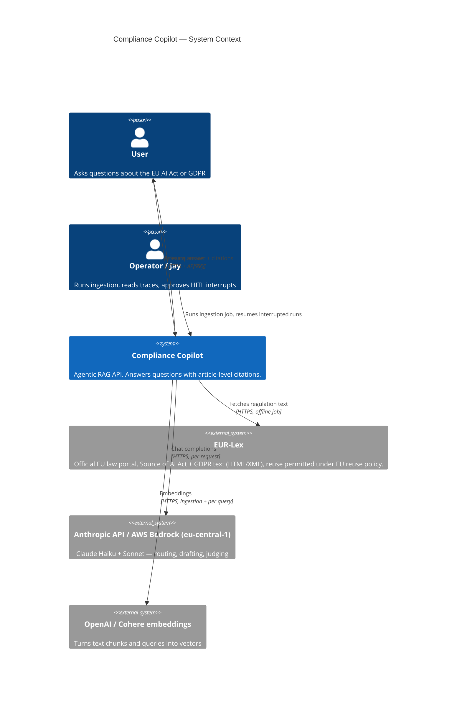
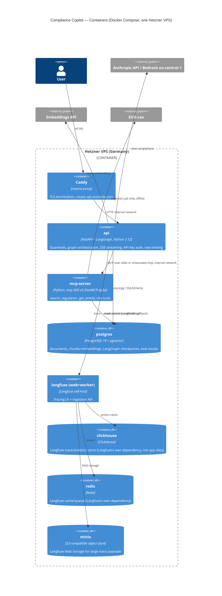
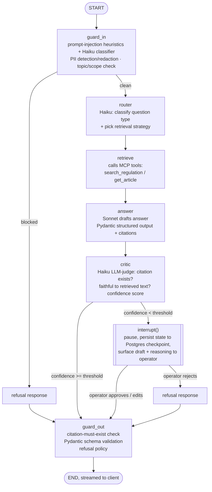
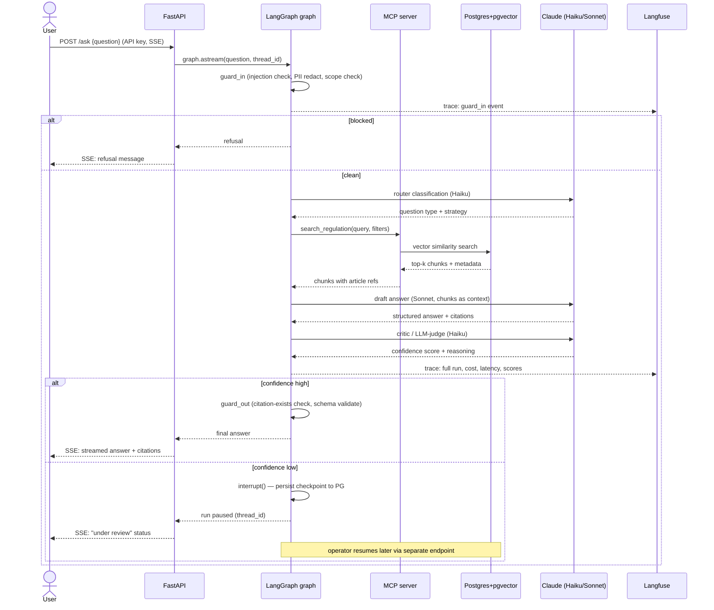

# Architecture — Compliance Copilot

Agentic RAG (retrieval-augmented generation — the model answers using text it retrieved from a document store, not from memory alone) over two EU regulations: the **EU AI Act** (Regulation (EU) 2024/1689) and **GDPR** (Regulation (EU) 2016/679), sourced from EUR-Lex (the EU's official law portal). Every answer must cite the article it came from. This document is the system-level reference; each individual technology choice has its own ADR under `docs/decisions/`.

Reader assumed: knows basic Python, is new to agents/RAG/LangGraph. Terms are explained in one line the first time they appear.

## 1. Overview

The system has four moving parts:

1. **Ingestion (offline, one-off/periodic job).** Downloads the AI Act and GDPR HTML/XML from EUR-Lex, splits each into chunks by article/recital (a "chunk" is the unit of text we embed and search over — here, roughly one article or recital plus its heading), embeds each chunk (turns text into a vector — a list of numbers — using an embedding model, so that "similar meaning" becomes "small distance between vectors"), and writes chunks + vectors + metadata (regulation, article number, title) into Postgres/pgvector.
2. **Agent (online, per request).** A LangGraph graph (a state machine where each node is a Python function and edges decide what runs next — see §4) that takes a user question, checks it for abuse, decides how to answer it, retrieves relevant chunks via MCP tools, drafts an answer, checks the draft for citation correctness, and either returns it or pauses for a human (HITL — human-in-the-loop) if it isn't confident.
3. **Tools (MCP server).** A separate process exposing `search_regulation`, `get_article`, `cite` over the Model Context Protocol (MCP — a standard way for an LLM application to call external tools/data sources, so the tool implementation is decoupled from the agent framework). The LangGraph agent calls these tools instead of embedding retrieval logic directly in graph nodes.
4. **API + observability.** FastAPI serves the graph over HTTP with streaming (SSE — Server-Sent Events, a simple one-way push protocol over plain HTTP, used here to stream partial answer tokens to the client). Every LLM call and tool call is traced to a self-hosted Langfuse instance for cost/latency/quality visibility.

Everything runs in Docker Compose on one Hetzner Cloud VPS in Germany, so both the regulation data and any user-submitted text stay in the EU end to end (see §6, data residency).

## 2. C4 — Context diagram

C4 is a standard way to describe software architecture at four zoom levels; "Context" is the widest — who/what talks to the system, with no internals shown.

## 3. C4 — Container diagram

"Container" here means a deployable unit (a Docker container, in this project's case — the C4 term predates Docker and just means "a separately runnable/deployable thing"), not a database table.

**Note on ADR-0003 ("Postgres is the one database"):** that decision is true for *application* data — documents, chunks/embeddings, LangGraph checkpoints, and eval results all live in the single `postgres` container. It is not true for the full deployed stack: self-hosted Langfuse (ADR-0009) brings its own ClickHouse, Redis, and S3-compatible blob store as hard dependencies of the Langfuse product, not something this project chose to add. See ADR-0003 §"Why not the others" and ADR-0009 for the full explanation, and §7 below for the resulting VPS sizing impact.

## 4. The LangGraph graph

A **node** is a Python function that reads and updates shared state; an **edge** decides which node runs next. **Interrupt** means the graph pauses mid-run and waits for external input (a human) before resuming — LangGraph persists the paused state to the Postgres checkpointer so the pause can outlast the process.

State carried through the graph (conceptually — the actual `TypedDict`/Pydantic schema is defined in code, not here): the original question, redacted question, classification, retrieved chunks with article IDs, draft answer, citation list, critic confidence score and reasoning, and a running list of guardrail events (for the trace and for the refusal message if one is needed).

Why `interrupt()` and not just a low-confidence label in the response: the eval-gated CI pipeline (ADR-0005) measures faithfulness and citation correctness on a golden set, but at *runtime*, on questions outside that golden set, a human review step is the guardrail of last resort before an uncertain legal-adjacent answer reaches a user. This is also the strongest "I built durable, resumable agent state" demonstration for the target job market (see `docs/research/market_research.md`).

## 5. Request flow (sequence diagram)

## 6. Trust boundaries

Numbered boundaries, referencing the container diagram:

1. **User ↔ Caddy.** Untrusted input. TLS terminates here; API key required past this point; slowapi rate limiting applies here too.
2. **Caddy ↔ api.** Trusted internal network (Docker Compose bridge network), but the *content* crossing it (the user's question) is still untrusted until `guard_in` runs — the API layer must not assume anything upstream has sanitized it.
3. **api ↔ mcp-server.** Trusted (same operator, same network), but MCP tool inputs are still validated against a schema (Pydantic) before hitting Postgres — a compromised or buggy graph node should not be able to pass an arbitrary SQL fragment through.
4. **api/mcp-server ↔ Postgres.** Trusted, parameterized queries only (SQLAlchemy/asyncpg), least-privilege DB role per service.
5. **api ↔ Anthropic/Bedrock, embeddings.** Leaves the VPS. This is the one boundary where user-derived text (the question, retrieved chunks) is sent to a third party — see §8 (data residency) for which provider/region is used and why.
6. **api ↔ Langfuse.** Internal, but trace payloads can contain the user's question and the model's answer — PII redaction in `guard_in` runs *before* the question is used anywhere downstream, including in traces, precisely so this boundary doesn't leak PII into Langfuse/ClickHouse.
7. **Ingestion job ↔ EUR-Lex.** Outbound only, offline, no user data involved — lowest-risk boundary in the system.

The most important boundary for a legal-RAG system specifically is #1→#2: everything past guard_in is written as if guard_in is trustworthy, so guard_in bugs are the highest-severity bug class in this codebase.

## 7. Failure modes

| Failure | Detection | Behavior |
|---|---|---|
| **LLM timeout / provider 5xx** (Anthropic or Bedrock) | SDK-level timeout/retry (exponential backoff, per ADR-0002's client config) exhausted | Node raises; graph run ends in an `error` state, not a silent partial answer. API returns HTTP 502 with a generic message; full exception + `request_id` goes to structured logs and to the Langfuse trace (marked `error`), never to the user. No partial/unfaithful answer is ever streamed. |
| **DB down** (Postgres unreachable) | Connection error on first query (retrieval or checkpoint read/write) | Retrieval: graph run fails closed — no answer is generated from an LLM's un-grounded memory, because that would defeat the entire "cite your source" premise of the project. Checkpointing: if a run cannot even *start* a checkpoint, `interrupt()` cannot function — the graph runs without HITL for that request only if the design explicitly allows a checkpointer-less fallback (default: it does **not**; the request fails fast with 503 instead). |
| **Prompt injection detected** (`guard_in`) | Heuristic pattern match + Haiku classifier flags the input | Request refused before it reaches the router node — never reaches retrieval or the main LLM call. Refusal is logged (event, not full raw content) and traced. No retry-with-different-prompt on the same request; the user must resubmit. |
| **No citation found** (`guard_out`) | Pydantic validator checks every claim in the answer has a matching `article` reference that exists in the retrieved-chunks list from this run (not just "looks like a citation") | Answer is not returned as-is. Two configurable behaviors, chosen at merge time via the golden-set eval, default = **refuse**: return a fixed "I couldn't find a specific article to support this" message rather than emit an uncited legal claim. (Regenerate-once-then-refuse is the stretch option, not the default, to keep the guardrail's behavior simple and auditable.) |
| **Critic confidence low** | LLM-judge score below threshold | Not a failure exactly — the designed HITL path (§4): `interrupt()`, operator reviews, resumes or rejects. If no operator responds within a configured timeout, the run stays paused (LangGraph checkpoints don't expire on their own) — an ops-facing TODO is to add a background job that auto-expires stale paused runs, out of scope for the 6-week build. |
| **Rate limit hit** (slowapi) | Per-API-key request counter | HTTP 429 with `Retry-After` header. No graph run is started — cheapest possible rejection point. |
| **MCP server unreachable** | Connection/timeout from `langchain-mcp-adapters` client | Treated the same as DB-down for retrieval purposes (the MCP server's tools are the *only* path to Postgres for the graph) — run fails closed, 503. |

## 8. Data residency notes

- **Corpus.** EUR-Lex text is public EU legislation; no residency concern on the source data itself.
- **User questions and generated answers.** May contain PII if a user pastes it in (e.g., "does GDPR let my employer do X to me, an example being [name/detail]"); `guard_in` runs PII detection/redaction (Presidio, ADR-0006) before the question is used in any downstream call, including the third-party LLM call.
- **LLM inference.** ADR-0002 defaults to the Anthropic API directly for development speed; the documented **production path** is AWS Bedrock in `eu-central-1` (Frankfurt) specifically so inference happens inside the EU. This is a real gap to be explicit about: Anthropic's direct API is not itself an EU-region-pinned service the way Bedrock eu-central-1 is, so "EU residency" as a claim is only true once the Bedrock path is live, not on day one with the direct API. Document this honestly in any portfolio write-up rather than overclaiming.
- **Embeddings.** Same pattern — OpenAI `text-embedding-3-small` by default (US), Cohere `embed-multilingual-v3` via Bedrock `eu-central-1` as the documented production option (ADR-0004).
- **Everything else** (Postgres, Langfuse + its ClickHouse/Redis/MinIO dependencies, the API, the MCP server) runs on a Hetzner VPS physically located in Germany (ADR-0010) — no data leaves the EU through these components.
- **Bottom line:** the architecture's EU-residency story is "storage and observability are EU by construction (Hetzner DE); inference and embeddings are EU by *choice of provider/region*, and that choice is the Bedrock/eu-central-1 path, not the cheaper default path used for day-to-day development." A portfolio write-up should state this distinction rather than imply the whole system is EU-only from the first commit.

## 9. Cost model sketch

Rough, for a low-traffic portfolio deployment (not production load). All figures approximate and meant to be revisited once real usage numbers exist — treat this as a first-order sanity check, not a budget commitment.

**Fixed monthly costs (infrastructure):**

| Item | Approx. cost/month |
|---|---|
| Hetzner Cloud VPS (enough RAM for Postgres + ClickHouse + Redis + api + mcp-server + Caddy — likely a CX32/CPX31-class box, 8 GB RAM, given ClickHouse's memory appetite) | €15–25 |
| Domain + TLS | ~€1 (Caddy automates TLS via Let's Encrypt, free) |
| **Total fixed** | **~€20–30/month** |

**Variable costs (usage-based):**

| Item | Driver | Notes |
|---|---|---|
| Claude Haiku calls (router + critic/judge) | 2 calls/request, small prompts | $1/$5 per MTok in/out (as of this doc) — cheap per call, dominates only at high volume |
| Claude Sonnet calls (final answer) | 1 call/request, larger prompt (retrieved chunks + question) | $3/$15 per MTok — the main per-request cost driver |
| Embeddings | 1 call/query (question) + ingestion (one-off, ~2 documents' worth of chunks) | text-embedding-3-small is inexpensive; ingestion cost is a one-time/rare cost, not per-request |
| Ragas/LLM-judge eval runs | Per CI run (GitHub Actions merge gate), on the golden set only | Bounded by golden-set size × PRs/week, not by user traffic |

**Ballpark per-question cost:** with a Haiku router call (~500 in / 100 out tokens), a Sonnet answer call (~3,000 in with retrieved context / 500 out), and a Haiku critic call (~1,000 in / 150 out), total is well under $0.02/question at current per-token prices — cost is not the constraining factor for a portfolio-scale deployment; the fixed VPS cost dominates at low volume. **Prompt caching** (caching the stable system prompt / tool descriptions across requests, per ADR-0002/ADR-0007) reduces the input-token cost further on the Sonnet call in particular, since the retrieved-chunk context and tool schema are the same shape across many requests even though the specific chunks differ per query — caching mainly saves on the system prompt and fixed instructions, not on the retrieved content itself.

**What would change this model:** GitHub Actions minutes if the eval suite grows large and runs on every push (mitigate: run the full Ragas suite only on PRs targeting `develop`/`main`, not every commit); Langfuse trace volume growing ClickHouse storage over months (mitigate: configure a trace retention/TTL policy, not part of the default self-host compose file — flagged as an operational follow-up, not solved in this document).

## References

Library versions verified 2026-08-23 against PyPI + official docs (Context7 + WebFetch); see individual ADRs for the doc URL and version per library. LangGraph interrupt/`Command(resume=...)` semantics verified against `langchain-ai/langgraph` (checked via Context7, source: `libs/langgraph/tests/test_time_travel.py` and `libs/prebuilt/README.md`). Langfuse self-host service list verified against `https://langfuse.com/self-hosting/deployment/docker-compose` and the linked infrastructure pages for ClickHouse, Redis (cache), and blob storage.

> **Planner note 2026-08-23:** v1.0 uses Langfuse Cloud (EU region) per ADR-0009 amendment; the VPS sizing in §9 therefore drops to a 4 GB-class box. Self-hosted Langfuse is a Week-6 stretch.
