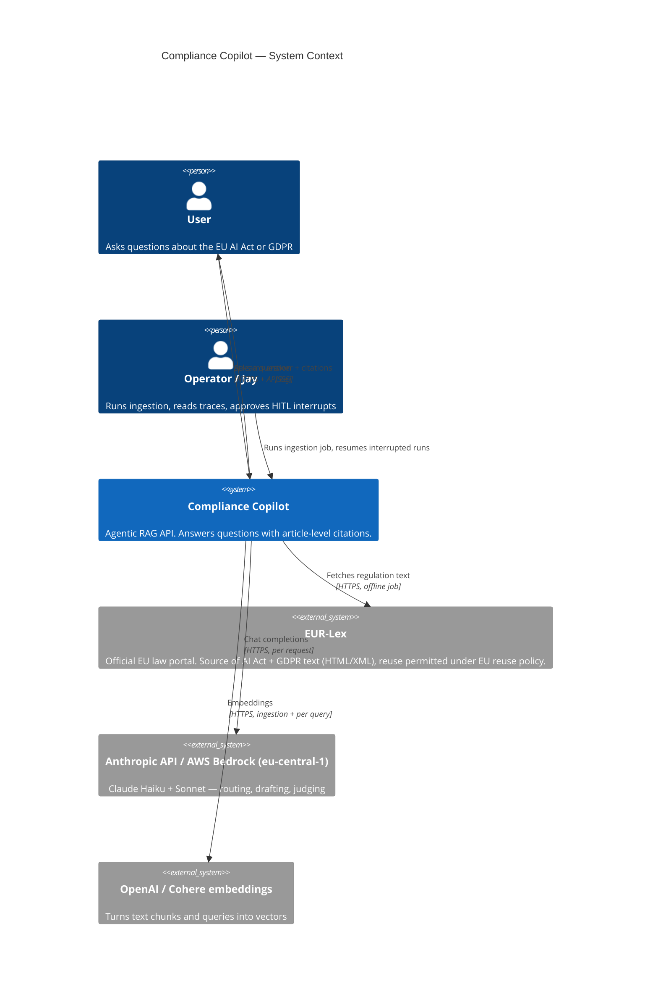
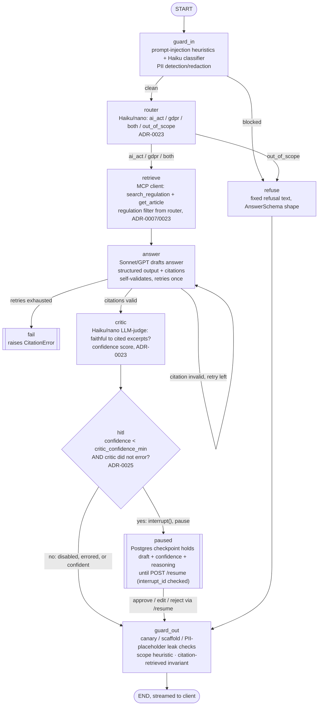

# Architecture — Compliance Copilot

Agentic RAG (retrieval-augmented generation — the model answers using text it retrieved from a document store, not from memory alone) over two EU regulations: the **EU AI Act** (Regulation (EU) 2024/1689) and **GDPR** (Regulation (EU) 2016/679), sourced from EUR-Lex (the EU's official law portal). Every answer must cite the article it came from. This document is the system-level reference; each individual technology choice has its own ADR under `docs/decisions/`.

Reader assumed: knows basic Python, is new to agents/RAG/LangGraph. Terms are explained in one line the first time they appear.

## 1. Overview

The system has four moving parts:

1. **Ingestion (offline, one-off/periodic job).** Downloads the AI Act and GDPR HTML/XML from EUR-Lex, splits each into chunks by article/recital (a "chunk" is the unit of text we embed and search over — here, roughly one article or recital plus its heading), embeds each chunk (turns text into a vector — a list of numbers — using an embedding model, so that "similar meaning" becomes "small distance between vectors"), and writes chunks + vectors + metadata (regulation, article number, title) into Postgres/pgvector.
2. **Agent (online, per request).** A LangGraph graph (a state machine where each node is a Python function and edges decide what runs next — see §4) that takes a user question, checks it for abuse, decides how to answer it, retrieves relevant chunks via MCP tools, drafts an answer, checks the draft for citation correctness, and either returns it or pauses for a human (HITL — human-in-the-loop) if it isn't confident.
3. **Tools (MCP server).** A separate process exposing `search_regulation`, `get_article`, `cite` over the Model Context Protocol (MCP — a standard way for an LLM application to call external tools/data sources, so the tool implementation is decoupled from the agent framework). The LangGraph agent calls these tools instead of embedding retrieval logic directly in graph nodes.
4. **API + observability.** FastAPI serves the graph over HTTP with streaming (SSE — Server-Sent Events, a simple one-way push protocol over plain HTTP, used here to stream partial answer tokens to the client). Every LLM call and tool call is traced to a self-hosted Langfuse instance for cost/latency/quality visibility.

Everything runs in Docker Compose on one Hetzner Cloud VPS in Germany, so both the regulation data and any user-submitted text stay in the EU end to end (see §6, data residency).

## 2. C4 — Context diagram

C4 is a standard way to describe software architecture at four zoom levels; "Context" is the widest — who/what talks to the system, with no internals shown.



## 3. C4 — Container diagram

"Container" here means a deployable unit (a Docker container, in this project's case — the C4 term predates Docker and just means "a separately runnable/deployable thing"), not a database table.


**Note on ADR-0003 ("Postgres is the one database"):** that decision is true for *application* data — documents, chunks/embeddings, LangGraph checkpoints, and eval results all live in the single `postgres` container. It is not true for the full deployed stack: self-hosted Langfuse (ADR-0009) brings its own ClickHouse, Redis, and S3-compatible blob store as hard dependencies of the Langfuse product, not something this project chose to add. See ADR-0003 §"Why not the others" and ADR-0009 for the full explanation, and §7 below for the resulting VPS sizing impact.

## 4. The LangGraph graph

A **node** is a Python function that reads and updates shared state; an **edge** decides which node runs next. **Interrupt** means the graph pauses mid-run and waits for external input (a human) before resuming — LangGraph persists the paused state to the Postgres checkpointer so the pause can outlast the process.

**ADR-0024 (Day 19):** the Postgres checkpointer described above is live for *every* run today — `build_graph(checkpointer=...)` compiles with an `AsyncPostgresSaver` in the API/CLI (`InMemorySaver` in unit tests), keyed by the `thread_id` a client sends back on `/ask`. This is what makes a follow-up question ("and what about deployers?") see the prior turn's question/answer, capped to the last 3 turns and rendered into the prompt after the system prompt, before the current excerpts. It is also a prerequisite for `interrupt()` (§ below) — LangGraph raises if `Command(resume=...)` is used without one.

**ADR-0025 (Day 20):** `hitl` is a real node, between `critic` and `guard_out`. It calls `interrupt()` only when the critic ran, did NOT error (a critic-tier outage is fail-open — no pause, same reasoning ADR-0019 gives the classifier's own outage — round 2 fix), AND scored below `settings.critic_confidence_min` — otherwise it is a pass-through. All edges below are the actual compiled graph (`graph/build.py`,
`grep -rn "add_node" src/compliance_copilot/graph/build.py` is the source of truth).



State carried through the graph (conceptually — the actual `TypedDict`/Pydantic schema is defined in code, not here): the original question, redacted question, router label, retrieved chunks with article IDs, draft answer, citation list, critic confidence score and reasoning, and a running list of guardrail events (for the trace and for the refusal message if one is needed).

Why `interrupt()` and not just a low-confidence label in the response: the eval-gated CI pipeline (ADR-0005) measures faithfulness and citation correctness on a golden set, but at *runtime*, on questions outside that golden set, a human review step is the guardrail of last resort before an uncertain legal-adjacent answer reaches a user — a label in a response body is something a client can just as easily ignore as read; `interrupt()` structurally cannot continue without a decision. This is also the strongest "I built durable, resumable agent state" demonstration for the target job market (see `docs/research/market_research.md`).

`hitl`'s three resume decisions (ADR-0025) all converge on the SAME `guard_out` gate `refuse`/`answer` already do — an operator's edited text is never exempt from the citation/scaffold/canary/placeholder checks a model's own draft has to pass:

- **approve** — the draft proceeds to `guard_out` unchanged.
- **edit** — the operator's text replaces the draft's `answer`, but the draft's own (already-validated) `citations` are kept; the resulting `AnswerSchema` still runs through `guard_out` like anything else.
- **reject** — resolves to the same fixed refusal `refuse_node` produces; not added to conversation history.

## 5. Request flow (sequence diagram)

```mermaid
sequenceDiagram
    actor U as User
    participant API as FastAPI
    participant G as LangGraph graph
    participant M as MCP server
    participant PG as Postgres+pgvector
    participant LLM as Claude (Haiku/Sonnet)
    participant LF as Langfuse

    U->>API: POST /ask {question} (API key, SSE)
    API->>G: graph.astream(question, thread_id)
    G->>G: guard_in (injection check, PII redact, scope check)
    G-->>LF: trace: guard_in event
    alt blocked
        G-->>API: refusal
        API-->>U: SSE: refusal message
    else clean
        G->>LLM: router (nano/Haiku): ai_act / gdpr / both / out_of_scope
        LLM-->>G: regulation label
        alt out_of_scope
            G-->>API: refusal (no retrieval spend)
            API-->>U: SSE: refusal message
        else in scope
            G->>M: search_regulation(query, regulation filter)
            M->>PG: vector similarity search
            PG-->>M: top-k chunks + metadata
            M-->>G: chunks with article refs
            G->>LLM: draft answer (Sonnet, chunks as context)
            LLM-->>G: structured answer + citations
            G->>LLM: critic (nano/Haiku): faithful to cited excerpts?
            LLM-->>G: confidence score + reasoning
            G-->>LF: trace: full run, cost, latency, scores (incl. critic_faithful/critic_confidence)
            alt confidence >= critic_confidence_min, critic disabled, or critic errored (ADR-0025 round 2)
                G->>G: guard_out (citation-exists check, schema validate)
                G-->>API: final answer
                API-->>U: SSE: streamed answer + citations
            else confidence below threshold, critic did NOT error
                G->>PG: interrupt() — checkpoint holds draft + confidence + reasoning
                G-->>API: {"__interrupt__": ...}
                API-->>U: SSE: interrupt {thread_id, interrupt_id, status: "under_review"}
                Note over U,API: end-user-facing — NO draft/confidence/reasoning<br/>on this channel (ADR-0025 round 2, SHOULD 1);<br/>stream ends here, no final event yet
                U->>API: POST /resume {thread_id, interrupt_id, decision, edited_answer?}
                API->>PG: aget_state — validate thread is known, still paused,<br/>and interrupt_id matches the pending one
                API->>G: graph.astream(Command(resume={decision, edited_answer}))
                G->>G: hitl resumes: approve/edit/reject -> guard_out
                G->>G: guard_out (same checks, regardless of who supplied the text)
                G-->>API: final answer (or fixed refusal, if rejected/blocked)
                API-->>U: SSE: streamed answer + citations
            end
        end
    end
```

## 6. Trust boundaries

Numbered boundaries, referencing the container diagram:

1. **User ↔ Caddy.** Untrusted input. TLS terminates here; API key required past this point; slowapi rate limiting applies here too.
2. **Caddy ↔ api.** Trusted internal network (Docker Compose bridge network), but the *content* crossing it (the user's question) is still untrusted until `guard_in` runs — the API layer must not assume anything upstream has sanitized it.
3. **api ↔ mcp-server.** Trusted (same operator, same network), but MCP tool inputs are still validated against a schema (Pydantic) before hitting Postgres — a compromised or buggy graph node should not be able to pass an arbitrary SQL fragment through.
4. **api/mcp-server ↔ Postgres.** Trusted, parameterized queries only (SQLAlchemy/asyncpg), least-privilege DB role per service.
5. **api ↔ Anthropic/Bedrock, embeddings.** Leaves the VPS. This is the one boundary where user-derived text (the question, retrieved chunks) is sent to a third party — see §8 (data residency) for which provider/region is used and why.
6. **api ↔ Langfuse.** Internal, but trace payloads can contain the user's question and the model's answer — PII redaction in `guard_in` runs *before* the question is used anywhere downstream, including in traces, precisely so this boundary doesn't leak PII into Langfuse/ClickHouse.
7. **Ingestion job ↔ EUR-Lex.** Outbound only, offline, no user data involved — lowest-risk boundary in the system.

The most important boundary for a legal-RAG system specifically is #1→#2: everything past guard_in is written as if guard_in is trustworthy, so guard_in bugs are the highest-severity bug class in this codebase.

## 7. Failure modes

| Failure | Detection | Behavior |
|---|---|---|
| **LLM timeout / provider 5xx** (`APITimeoutError`/`APIConnectionError`/`RateLimitError`) | `answer_timeout_s`-bounded SDK call + one explicit SDK retry (`answer_max_retries`, ADR-0028) exhausted | `answer_node` catches it and returns a DEGRADED answer — the retrieved articles' regulation+anchor, zero citations, `degraded: true` on the `final` SSE event — never a bare 500, never a fake confident answer. `guard_out` still runs (canary/scaffold checks apply, citation-shaped checks are exempted the same way a `refused` answer's are); `critic`/`hitl` skip (nothing was drafted to critique); the turn isn't added to conversation history. Full exception class name goes to structured logs and a `degraded` Langfuse score, never a raw exception to the client. Separately, `settings.request_timeout_s` (ADR-0028) bounds the WHOLE request (every node, not just the answer call) via `asyncio.timeout` — its own timeout yields `{"type": "timeout"}` instead. |
| **DB down** (Postgres unreachable) | `sqlalchemy.exc.OperationalError` on first query (retrieval or checkpoint read/write), or on `/readyz`'s `SELECT 1` (ADR-0028) | Mid-request: `_run_graph_and_stream` catches `OperationalError` specifically (before the generic handler) and emits `{"type": "dependency_unavailable"}` — distinct from a generic `internal_error`, so an operator doesn't need a stack trace to tell "DB is down" from "there's a bug." Retrieval still fails closed either way — no answer is generated from an LLM's un-grounded memory. `GET /readyz` (new, ADR-0028) gives an orchestrator a direct 200/503 readiness probe against the same DB the request path depends on; `/healthz` stays DB-free (a liveness probe must not depend on anything that can fail independently of the process itself — proven by a test that keeps `/healthz` at 200 under the same broken-DB override that 503s `/readyz`). Checkpointing: if a run cannot even *start* a checkpoint, `interrupt()` cannot function — the graph runs without HITL for that request only if the design explicitly allows a checkpointer-less fallback (default: it does **not**; the request fails fast instead). |
| **Prompt injection detected** (`guard_in`) | Heuristic pattern match + Haiku classifier flags the input | Request refused before it reaches the router node — never reaches retrieval or the main LLM call. Refusal is logged (event, not full raw content) and traced. No retry-with-different-prompt on the same request; the user must resubmit. |
| **No citation found** (`guard_out`) | Pydantic validator checks every claim in the answer has a matching `article` reference that exists in the retrieved-chunks list from this run (not just "looks like a citation") | Answer is not returned as-is. Two configurable behaviors, chosen at merge time via the golden-set eval, default = **refuse**: return a fixed "I couldn't find a specific article to support this" message rather than emit an uncited legal claim. (Regenerate-once-then-refuse is the stretch option, not the default, to keep the guardrail's behavior simple and auditable.) |
| **Critic confidence low** | LLM-judge score below `settings.critic_confidence_min`, AND the critic did NOT error | Not a failure exactly — the shipped HITL path (§4, ADR-0025): `hitl_node` calls `interrupt()`, the run pauses (Postgres checkpoint), `/ask`'s stream ends with an `interrupt` event `{thread_id, interrupt_id, status}` (no draft/confidence/reasoning — round 2, SHOULD 1 — and no `final`), and `POST /resume {thread_id, interrupt_id, decision, edited_answer?}` continues it: approve/edit/reject, all still gated by `guard_out`. A stale/wrong `interrupt_id`, or a `thread_id` that's already paused when `/ask` is called again, is rejected (409) rather than silently superseding a pending review (round 2, BLOCKER 2). If no operator ever resumes it, the run stays paused indefinitely — LangGraph checkpoints don't expire on their own, and no expiry/retention job exists yet (`# ponytail:` in ADR-0025) — an ops-facing TODO, out of scope for the 6-week build. |
| **Critic tier outage** (rate limit, timeout, provider 5xx during the critic's own LLM call) | `critique()`'s exception path (critic.py), flagged `CriticVerdict.error=True` | Fails OPEN, not to a pause — round 2 fix (ADR-0025, BLOCKER 1): pausing every request during a critic outage would turn a guard-tier outage into a full product outage (same reasoning ADR-0019 already applies to the classifier). The run proceeds straight to `guard_out` (its independent checks still run); a `critic_unavailable` guardrail event is logged and scored so the coverage gap is visible, not hidden. |
| **Rate limit hit** (slowapi) | Per-API-key request counter | HTTP 429 with `Retry-After` header. No graph run is started — cheapest possible rejection point. |
| **MCP server unreachable** | Connection/timeout from `langchain-mcp-adapters` client | Treated the same as DB-down for retrieval purposes (the MCP server's tools are the *only* path to Postgres for the graph) — run fails closed, 503. |

## 8. Data residency notes

- **Corpus.** EUR-Lex text is public EU legislation; no residency concern on the source data itself.
- **User questions and generated answers.** May contain PII if a user pastes it in (e.g., "does GDPR let my employer do X to me, an example being [name/detail]"); `guard_in` runs PII detection/redaction (Presidio, ADR-0006) before the question is used in any downstream call, including the third-party LLM call.
- **LLM inference.** ADR-0002's 2026-08-24 amendment ships OpenAI (`gpt-4.1-mini`/`nano`) as the interim provider via the `LLM_PROVIDER` switch, with Anthropic as the documented target; the documented **production path** is AWS Bedrock in `eu-central-1` (Frankfurt) specifically so inference happens inside the EU. This is a real gap to be explicit about: Anthropic's direct API is not itself an EU-region-pinned service the way Bedrock eu-central-1 is, so "EU residency" as a claim is only true once the Bedrock path is live, not on day one with the direct API. Document this honestly in any portfolio write-up rather than overclaiming.
- **Embeddings.** Same pattern — OpenAI `text-embedding-3-small` by default (US), Cohere `embed-multilingual-v3` via Bedrock `eu-central-1` as the documented production option (ADR-0004).
- **Everything else** (Postgres, Langfuse + its ClickHouse/Redis/MinIO dependencies, the API, the MCP server) runs on a Hetzner VPS physically located in Germany (ADR-0010) — no data leaves the EU through these components.
- **Bottom line:** the architecture's EU-residency story is "storage and observability are EU by construction (Hetzner DE); inference and embeddings are EU by *choice of provider/region*, and that choice is the Bedrock/eu-central-1 path, not the cheaper default path used for day-to-day development." A portfolio write-up should state this distinction rather than imply the whole system is EU-only from the first commit.

## 9. Cost model — measured (ADR-0029)

Superseded the original hand-estimated Claude-tier sketch: the shipped
system runs on OpenAI (`gpt-4.1-mini`/`gpt-4.1-nano`, ADR-0002's 2026-08-24
amendment), and `evals/run_cost_report.py` now measures real per-question
token usage instead of assuming counts. Anthropic/Bedrock stays the
documented **alternative** production path (below), priced from ADR-0002's
recorded figures, not re-measured here.

**Fixed monthly costs (infrastructure)** — unchanged, still a sketch (no
deployed instance to measure against yet):

| Item | Approx. cost/month |
|---|---|
| Hetzner Cloud VPS (enough RAM for Postgres + ClickHouse + Redis + api + mcp-server + Caddy — likely a CX32/CPX31-class box, 8 GB RAM, given ClickHouse's memory appetite) | €15–25 |
| Domain + TLS | ~€1 (Caddy automates TLS via Let's Encrypt, free) |
| **Total fixed** | **~€20–30/month** |

**Variable costs — measured, n=10 golden questions, 2026-09-02** (full
detail and methodology: `docs/EVALS.md`'s "Cost per question" section):

| Model | Role | USD (10 questions) | Cached fraction |
|---|---|---|---|
| `gpt-4.1-mini` | answer (the one call a user reads) | $0.01163 | 81.7% |
| `gpt-4.1-nano` | classifier + router + critic, pooled (share one model id) | $0.00249 | 34.7% |
| `text-embedding-3-small` | one query embedding/question | rounding error next to the above | n/a (no prefix cache) |

**Measured: €0.130 per 100 questions** (€0.00130/question, n=10 — see
`docs/EVALS.md` for the small-sample caveat and the one golden question
that reproduced a citation-validation refusal). This replaces the old
"well under $0.02/question" hand estimate with an actual number; both
pointed the same direction (cost is not the constraining factor at
portfolio scale — the fixed VPS cost dominates at low volume), but this one
is measured, not assumed. `gpt-4.1-mini` (the answer call) is 82% of the
measured chat-model spend — the same "don't underspend on the call a user
actually reads" reasoning ADR-0002 already argues for, now with a number
behind it.

**Prompt caching — what was actually observed, not theorized:** OpenAI's
automatic prefix caching engages once a prompt prefix exceeds roughly
1,024 tokens. The answer call's prompt is ordered system-prompt-first
(`_build_messages`/`_system_message`, `graph/nodes.py`) specifically so
that stable prefix gets cached across calls, and the measured 81.7% cached
fraction on `gpt-4.1-mini` confirms it's actually happening. The
guard-tier calls (`gpt-4.1-nano`) cache at a much lower 34.7% — their
prompts are shorter, so a larger share of individual calls likely falls
under the threshold and misses the cache. Caching mainly pays off on the
system prompt and fixed instructions, not on the retrieved content itself
(which differs per query and can't be a shared cached prefix).

**Anthropic/Bedrock — the documented alternative, not shipped:** ADR-0002's
target path (Haiku `$1.00/$5.00` per MTok, Sonnet `$3.00/$15.00`, recorded
2026-08-23 — reverify before this path ships) remains the EU-residency
production option (§8). `compliance_copilot.costing.PRICES` carries both
Anthropic model rows for exactly this reason — switching `LLM_PROVIDER`
is a one-line config change (ADR-0002's "how to reverse"), and the same
`evals/run_cost_report.py` would re-measure real numbers on that path the
day a real `ANTHROPIC_API_KEY` exists, rather than re-estimating by hand.

**What would change this model:** a corpus/traffic scale-up (this is n=10,
not a load-tested number); GitHub Actions minutes if the eval suite grows
large and runs on every push (mitigate: run the full Ragas/answer-quality
suite only on PRs targeting `develop`/`main`, not every commit); Langfuse
trace volume growing ClickHouse storage over months (mitigate: configure a
trace retention/TTL policy, not part of the default self-host compose file
— flagged as an operational follow-up, not solved in this document).

## References

Library versions verified 2026-08-23 against PyPI + official docs (Context7 + WebFetch); see individual ADRs for the doc URL and version per library. LangGraph interrupt/`Command(resume=...)` semantics verified against `langchain-ai/langgraph` (checked via Context7, source: `libs/langgraph/tests/test_time_travel.py` and `libs/prebuilt/README.md`). Langfuse self-host service list verified against `https://langfuse.com/self-hosting/deployment/docker-compose` and the linked infrastructure pages for ClickHouse, Redis (cache), and blob storage.


> **Planner note 2026-08-23:** v1.0 uses Langfuse Cloud (EU region) per ADR-0009 amendment; the VPS sizing in §9 therefore drops to a 4 GB-class box. Self-hosted Langfuse is a Week-6 stretch.
